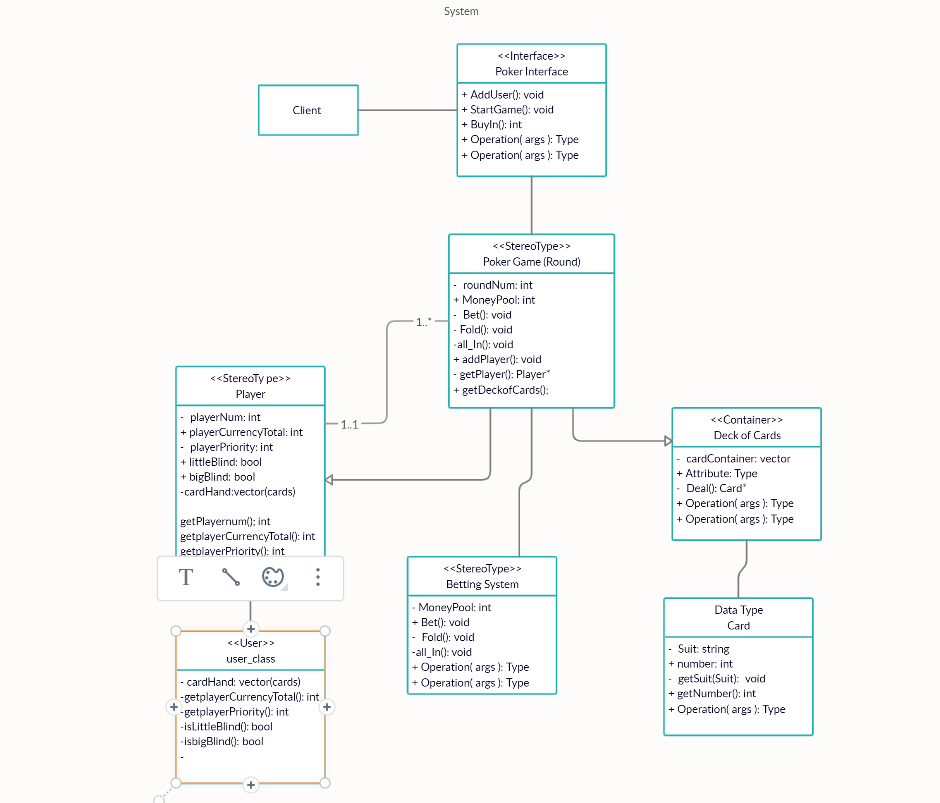

# CS 100 Programming Project

A:
  Kenny Yontwises - kyont001@ucr.edu, 
  Kenny Lay - klay001@ucr.edu, 
  Christian Melendez- cmele014@ucr.edu, 
  
B: 
  Title of the Project: Poker.io.
  
C:
  Possibly hybrid between web and mobile. If not a web will be the least.
  
D:
  It uses a deck of cards and a system for keeping track how much a user has gained and lost. Additionally, the software is able to show what poker hand rating you have. In these trying times, sometimes this poker game will stand as a reminder of Las Vegas and its exhilerating games in its Casinos.

E:
  Language we plan on using: C++. We want to use an interface that lets users input the bet and possibly see the cards that are being given to a persons hand. Mimicking that of a regular poker game in real life. 

F:
  Input involves planning how much you are betting in poker
  Output: Essentially is the combinations of cards that come out, showing whether it is winning hand or not. 

A:

B: 
Our Poker Game consists of three design patterns: visitor, composite and iterator. We utilize the composite pattern by implementing a component class called Player that implements default behavior for its leaves. Its leaves are the users that are playing the game (Player1, Player2, Player3...). We use the iterator design pattern by iterating through our deck of cards after each round. We also iterate through the Players in order to simulate each player's turn. We will use the visitor design pattern to implement our currency system. Since Poker utilizes different types of chips for its currency, we can implement a visit function for each chip that visits the Poker Game's currency. The Poker Game's accept function will add the chip's value to the MoneyPool. 
